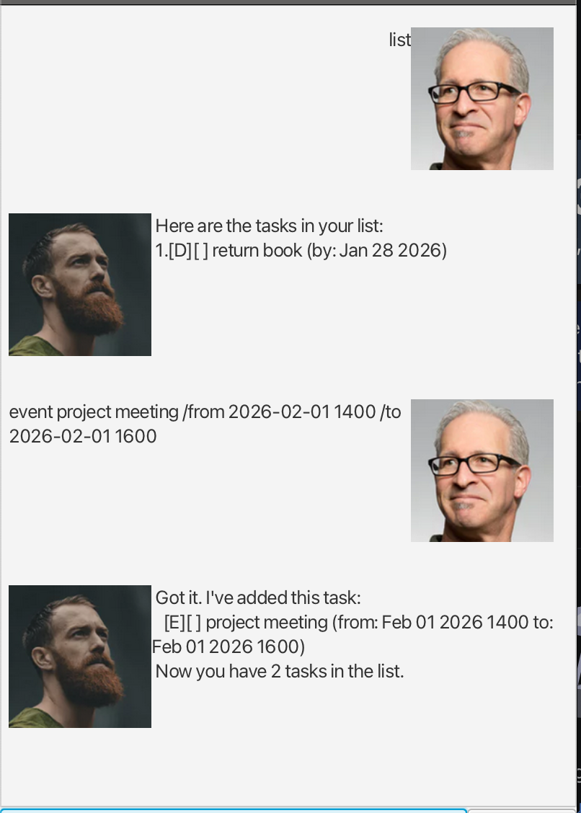

# KLChatBot User Guide



## Introduction
KLChatBot is a desktop GUI task manager that helps you track todos, deadlines, events, and fixed-duration tasks in a simple chat-style interface.

## Quick Start
1. Run `./gradlew run`.
1. Type a command in the input box and press Enter or click Send.
1. Use `list` to view tasks and `bye` to exit.

## Command Summary
All command keywords are lowercase and case-sensitive.

`todo DESCRIPTION`  
`deadline DESCRIPTION /by yyyy-MM-dd [HHmm]`  
`event DESCRIPTION /from yyyy-MM-dd [HHmm] /to yyyy-MM-dd [HHmm]`  
`duration DESCRIPTION /for DURATION`  
`list`  
`mark INDEX`  
`unmark INDEX`  
`delete INDEX`  
`find KEYWORD`  
`bye`

Date/time format: `yyyy-MM-dd` or `yyyy-MM-dd HHmm` (24-hour time).  
Duration format examples: `2h`, `30m`, `1h 30m`, `2 hours`, `45 mins`.  
Task indexes are 1-based and come from `list`.

## Features
### Add a todo
Command: `todo DESCRIPTION`

Example input: `todo read book`  
Example output:
```
Got it. I've added this task:
  [T][ ] read book
Now you have 1 tasks in the list.
```

### Add a deadline
Command: `deadline DESCRIPTION /by yyyy-MM-dd [HHmm]`

Example input: `deadline return book /by 2026-01-28`  
Example output:
```
Got it. I've added this task:
  [D][ ] return book (by: Jan 28 2026)
Now you have 2 tasks in the list.
```

### Add an event
Command: `event DESCRIPTION /from yyyy-MM-dd [HHmm] /to yyyy-MM-dd [HHmm]`

Example input: `event project meeting /from 2026-02-01 1400 /to 2026-02-01 1600`  
Example output:
```
Got it. I've added this task:
  [E][ ] project meeting (from: Feb 01 2026 1400 to: Feb 01 2026 1600)
Now you have 3 tasks in the list.
```

### Add a fixed-duration task
Command: `duration DESCRIPTION /for DURATION`

Example input: `duration read sales report /for 2h`  
Example output:
```
Got it. I've added this task:
  [F][ ] read sales report (for: 2h)
Now you have 4 tasks in the list.
```

### List tasks
Command: `list`

Example output:
```
Here are the tasks in your list:
 1.[T][ ] read book
 2.[D][ ] return book (by: Jan 28 2026)
 3.[E][ ] project meeting (from: Feb 01 2026 1400 to: Feb 01 2026 1600)
 4.[F][ ] read sales report (for: 2h)
```

### Mark a task as done
Command: `mark INDEX`

Example input: `mark 1`  
Example output:
```
Nice! I've marked this task as done:
  [T][X] read book
```

### Unmark a task
Command: `unmark INDEX`

Example input: `unmark 1`  
Example output:
```
OK, I've marked this task as not done yet:
  [T][ ] read book
```

### Find tasks by keyword
Command: `find KEYWORD`

Example input: `find book`  
Example output:
```
Here are the matching tasks in your list:
 1.[T][ ] read book
 2.[D][ ] return book (by: Jan 28 2026)
```

### Delete a task
Command: `delete INDEX`

Example input: `delete 1`  
Example output:
```
Noted. I've removed this task:
  [T][ ] read book
Now you have 3 tasks in the list.
```

### Exit
Command: `bye`

Example output:
```
Goodbye! Have a great day!
```

## Errors
If a command is invalid, KLChatBot responds with:
```
Sorry, I don't understand that command.
```
